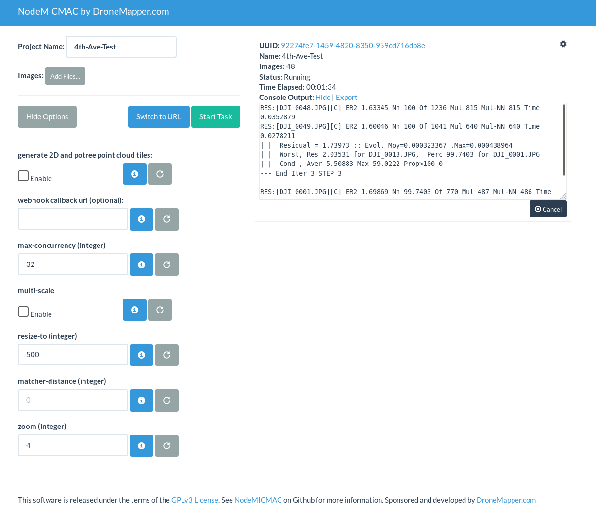
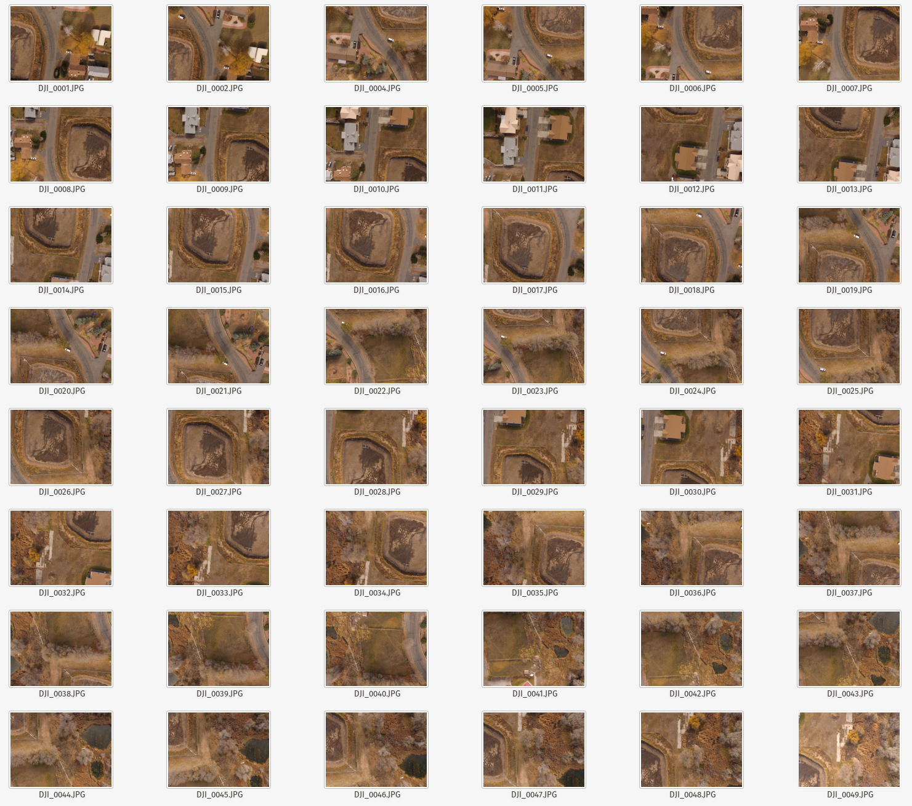
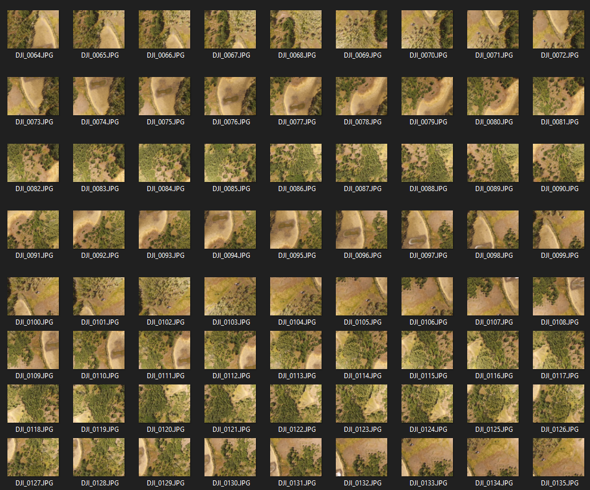
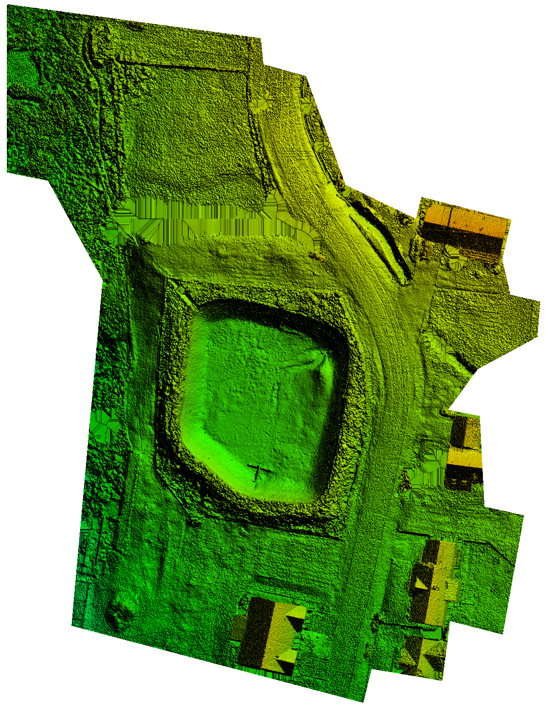
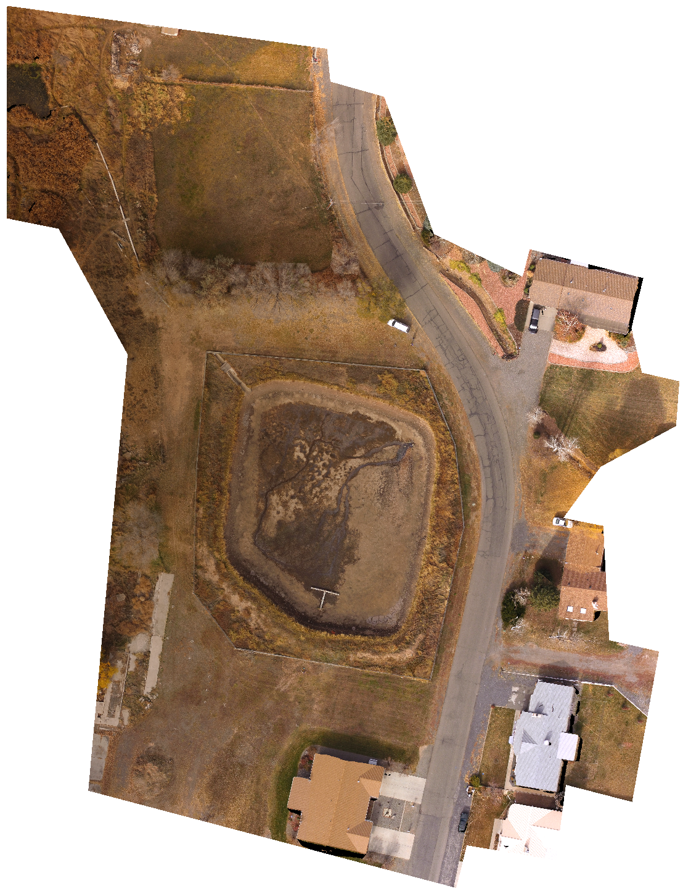
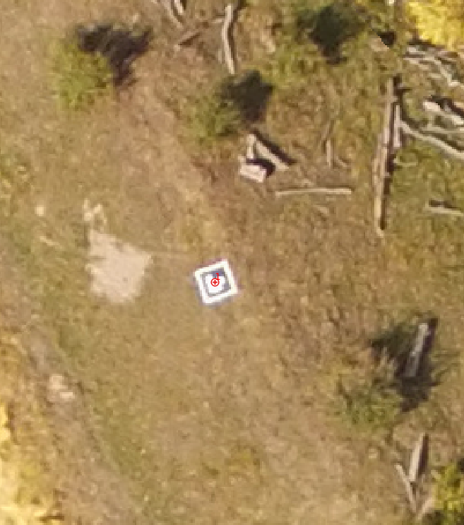

# NodeMICMAC
<br/><br/>

NodeMICMAC is a Node.js App and REST API to access [MicMac](https://github.com/micmacIGN/micmac). It exposes an API which is used by [WebODM](https://github.com/OpenDroneMap/WebODM) or other projects.
This project is sponsored and developed by [DroneMapper](https://dronemapper.com). This repository was originally forked from [NodeODM](https://github.com/OpenDroneMap/NodeODM), which is part of the [OpenDroneMap](https://www.opendronemap.org/) Project.



|  |  |   |   |
|---------------------------------------------------------------------------------------------------|--------------------------------------------------------------------|---|---|

## Project Status
This list is not by order of importance.

- [x] Forked NodeODM
- [x] Updated README
- [x] New Dockerfile
- [x] Add MicMac Source Build
- [x] Initial Docker & Native Testing
- [x] `run.sh` and `run.py` Image Processor
- [x] Digital Elevation Model Creation
- [x] Orthomosaic Creation
- [ ] External and Relative Camera Orientation Exports
- [ ] Interfaces w/ Other Software (PMVS/OpenSFM/Pix4D/DroneMapper)
- [x] Point Cloud
- [x] Post Processing
- [x] GCP Processing (Requires 3D "ground" and 2D "image" Files)
- [ ] Oblique Imagery and/or 3D Model
- [x] Conform / Rename Outputs to ODM Conventions
- [x] Wire Up 2D and Potree Tile Creation
- [x] Multi-Scale Tie-Point Generation (Similar to Photoscan)
- [ ] Export Undistorted Images
- [ ] Utilize RPY Omega Phi Kappa
- [x] Sparse Point Cloud w/ Camera Position
- [x] Point Cloud w/ Image Ground Footprints 
- [x] Initial Integration w/ WebODM
- [x] Full Integration w/ WebODM
- [x] Progress Reporting
- [ ] Staged Restart Ability
- [x] Optimize Orthomosaic Generation
- [ ] Multi-Threaded Orthomosaic Generation/Seamline Feathering (BETA)
 
Note: This project currently creates a geo-referenced DEM and Ortho from our 4th Ave. test imagery (and most likely your imagery). The results are located in their respective directories in UTM projection.

## Test Data
[DroneMapper 4th Ave. Reservoir](https://dronemapper.com/software/4thAve.zip) - 48 Geo-Tagged Images DJI Phantom 3 Advanced



[DroneMapper Greg 1 & 2 Reservoir](https://dronemapper.com/sample_data/) - 189 Geo-Tagged Images DJI Phantom 3 Advanced w/ Trimble 5800 Surveyed GCP Data



## 4th Ave. Results




## Gregg 1 & 2 GCP Results




* Results clipped to an AOI and displayed using Global Mapper [GlobalMapper](https://bluemarblegeo.com)

## Mission Planning / Execution

* We recommend using a mission planning application such as MapPilot, DJI GS Pro, or Pix4DMapper.

## Support

Commercial support for this project is available from [DroneMapper.com](https://dronemapper.com).

## Getting Started

We recommend that you setup NodeMICMAC using [Docker](https://www.docker.com/).

* Docker image build:
```
docker build -t dronemapper/node-micmac .
```

* From the Docker Quickstart Terminal (Windows / OSX) or from the command line (Linux) type:
```
docker run -p 3000:3000 dronemapper/node-micmac
```

* If you're on Windows/OSX, find the IP of your Docker machine by running this command from your Docker Quickstart Terminal:

```
docker-machine ip
```

Linux users can connect to 127.0.0.1.

* Open a Web Browser to `http://<yourDockerMachineIp>:3000`
* Load [some images with geo-tags](https://dronemapper.com/sample_data/)
* Press "Start Task"
* Go for a walk or enjoy a pastis! :)

If the computer running NodeMICMAC is using an old or 32bit CPU, you need to compile OpenDroneMap from sources and setup NodeMICMAC natively. You cannot use docker. Docker images work with CPUs with 64-bit extensions, MMX, SSE, SSE2, SSE3 and SSSE3 instruction set support or higher. Seeing a `Illegal instruction` error while processing images is an indication that your CPU is too old. 

## Using Ground Control Points

For GCP processing, you will need to include two files in txt format. Examples of the files are shown
below.

`DroneMapperGCP_3D.txt`

`GCPNAME UTMX UTMY Z PRECISIONXY PRECISIONZ`
```$xslt
base 250021.111 4319269.236 2593.462 0.005 0.005
1 250002.422 4319308.241 2594.213 0.005 0.005
pf1 250041.932 4319214.143 2590.057 0.005 0.005
hg1 250020.983 4319214.803 2590.412 0.005 0.005
sw1 250006.047 4319127.513 2592.616 0.005 0.005
2 249990.82 4319134.391 2592.927 0.005 0.005
3 249876.345 4319057.461 2593.507 0.005 0.005
4 250175.483 4319290.858 2584.199 0.005 0.005
hg2 250117.42 4319009.086 2565.418 0.005 0.005
5 250114.413 4318998.234 2567.861 0.005 0.005
sw2 250159.165 4319019.774 2567.198 0.005 0.005
```

`DroneMapperGCP_2D.txt`

`GCPNAME IMAGENAME PIXELX PIXELY`
```$xslt
1 DJI_0065.JPG 3036 1244
1 DJI_0066.JPG 3022 1915
1 DJI_0071.JPG 1859 1179
1 DJI_0072.JPG 1860 1800
1 DJI_0099.JPG 1350 1129
1 DJI_0100.JPG 1355 1779
2 DJI_0058.JPG 2872 1129
2 DJI_0059.JPG 2870 1741
2 DJI_0078.JPG 1997 1170
2 DJI_0079.JPG 2050 1787
2 DJI_0092.JPG 1219 1166
2 DJI_0093.JPG 1226 1736
3 DJI_0012.JPG 1477 458
3 DJI_0013.JPG 1521 1051
3 DJI_0014.JPG 1553 1677
3 DJI_0015.JPG 1595 2295
3 DJI_0020.JPG 1632 641
3 DJI_0021.JPG 1673 1312
3 DJI_0022.JPG 1699 1964
4 DJI_0166.JPG 2402 890
4 DJI_0167.JPG 2386 1442
4 DJI_0168.JPG 2378 1986
4 DJI_0173.JPG 2386 917
4 DJI_0174.JPG 2385 1502
4 DJI_0175.JPG 2410 2106
5 DJI_0120.JPG 2590 788
5 DJI_0121.JPG 2605 1286
5 DJI_0122.JPG 2622 1808
5 DJI_0151.JPG 2019 1093
5 DJI_0152.JPG 2049 1589
5 DJI_0153.JPG 2090 2061
5 DJI_0155.JPG 1335 1365
5 DJI_0156.JPG 1386 1832
```

The files should be space delimited and can be named anything, as long as `3D` exists in the ground filename and `2D` 
exists in the images filename.

* You can substitute the 2 GCP files above for a single GCP file that matches ODM format and is named `gcp_list.txt`.
Below is an example of ODM format:

```
+proj=utm +zone=12 +ellps=WGS84 +datum=WGS84 +units=m +no_defs 
575133.061 4776173.433 340.348 1975 1313 DJI_0012.JPG
575133.061 4776173.433 340.348 1957 2246 DJI_0013.JPG
575133.061 4776173.433 340.348 2047 1151 DJI_0017.JPG
575133.061 4776173.433 340.348 1992 2150 DJI_0018.JPG
575133.061 4776173.433 340.348 4959 2340 DJI_0041.JPG
574984.757 4776256.240 342.033 4355 1097 DJI_0055.JPG
574984.757 4776256.240 342.033 4301 2080 DJI_0056.JPG
574984.757 4776256.240 342.033 4271 2905 DJI_0057.JPG
574984.757 4776256.240 342.033 2830 1182 DJI_0058.JPG
574984.757 4776256.240 342.033 2626 2207 DJI_0059.JPG
575039.437 4776219.267 341.072 4973 2003 DJI_0024.JPG
575039.437 4776219.267 341.072 2153 459 DJI_0033.JPG
575039.437 4776219.267 341.072 2075 1431 DJI_0034.JPG
575039.437 4776219.267 341.072 1978 2467 DJI_0035.JPG
575039.437 4776219.267 341.072 1914 1711 DJI_0052.JPG
575039.437 4776219.267 341.072 1836 2712 DJI_0053.JPG
575002.291 4776187.176 340.717 1105 1155 DJI_0003.JPG
575002.291 4776187.176 340.717 1130 2114 DJI_0004.JPG
575002.291 4776187.176 340.717 2844 1311 DJI_0026.JPG
575002.291 4776187.176 340.717 2781 2393 DJI_0027.JPG
575002.291 4776187.176 340.717 4206 1172 DJI_0031.JPG
575002.291 4776187.176 340.717 4121 2154 DJI_0032.JPG
```

## API Options / Command Line Parameters

```bash
positional arguments:
  <project name>        Name of Project (i.e subdirectory of projects folder)

optional arguments:
  -h, --help            show this help message and exit
  --images <path>, -i <path>
                        Path to input images
  --project-path <path>
                        Path to the project folder
  --gcp <path>
                        Path to MicMac GCP txt files
  --max-concurrency <integer>
                        The maximum number of cores to use in processing.
                        Default: 4
  --resize-to <integer>
                        Scale image width for tie-point extraction. Default:
                        800
  --zoom <integer>      The level of DEM construction. 4 means 4x native GSD.
                        Default: 4 Values: 1, 2, 4, 8
  --matcher-distance <integer>
                        Distance threshold in meters to find pre-matching
                        images based on GPS exif data. Default: 0 (use auto-distance)
  --multi-scale         Uses an image file pair based multi-scale tie-point
                        generation routine similar to Photoscan.
  --remove-ortho-tiles  Remove every other ortho tile. Speeds up ortho creation and radiometric equalization.
  --camera-cloud        Creates a sparse point cloud with camera positions
  --image-footprint     Creates a point cloud and geojson with image footprints
  --ccd-width <float>   The CCD sensor width in millimeters (mm). Example:
                        6.17
  --ccd-height <float>  The CCD sensor height in millimeters (mm). Example:
                        4.55
  --version             Displays version number and exits.

```

## API Docs

See the ODM [API Documentation Page](https://github.com/OpenDroneMap/NodeODM/blob/master/docs/index.adoc).

## Run Tasks from the Command Line

You can use [CloudODM](https://github.com/OpenDroneMap/CloudODM) to run tasks with NodeMICMAC from the command line. _(Untested)_

## Using an External Hard Drive (Not Recommended/Performance IO Reasons)

If you want to store results on a separate drive, map the `/var/www/data` folder to the location of your drive:

```bash
docker run -p 3000:3000 -v /mnt/external_hd:/var/www/data dronemapper/node-micmac
```

This can be also used to access the computation results directly from the file system.

### Run it Natively

If you are already running [ODM](https://github.com/OpenDroneMap/ODM) on Ubuntu natively you can follow these steps:

* You may need to step through the Dockerfile and install missing dependencies listed there to install natively.

1] Install PotreeConverter and LASzip dependency
 
```bash
apt-get install -y libboost-dev libboost-program-options-dev exiftool

pip install Shapely
pip install utm

mkdir /staging
git clone https://github.com/pierotofy/LAStools /staging/LAStools
cd LAStools/LASzip
mkdir build
cd build
cmake -DCMAKE_BUILD_TYPE=Release ..
make

git clone https://github.com/pierotofy/PotreeConverter /staging/PotreeConverter
cd /staging/PotreeConverter
mkdir build
cd build
cmake -DCMAKE_BUILD_TYPE=Release -DLASZIP_INCLUDE_DIRS=/staging/LAStools/LASzip/dll -DLASZIP_LIBRARY=/staging/LAStools/LASzip/build/src/liblaszip.a ..
make && sudo make install
```
2] Install gdal2tiles.py script, node.js and npm dependencies

```bash
sudo curl --silent --location https://deb.nodesource.com/setup_6.x | sudo bash -
sudo apt-get install -y nodejs python-gdal
git clone hhttps://github.com/dronemapper-io/NodeMICMAC.git
cd NodeMICMAC
npm install
```

3] Start NodeMICMAC

```
nodejs index.js
```

Use odm_path

```
nodejs index.js --odm_path /home/projects/NodeMICMAC/dm/
```

For other command line options you can run:

```
nodejs index.js --help
```

You can also specify configuration values via a JSON file:

```
nodejs index.js --config config.default.json
```

Command line arguments always take precedence over the configuration file.

### Run it using PM2

The app can also be run as a background process using the [pm2 process manager](https://github.com/Unitech/pm2), which can also assist you with system startup scripts and process monitoring.

To install pm2, run (using `sudo` if required):
```shell
npm install pm2 -g
```
The app can then be started using
```shell
pm2 start processes.json
```
To have pm2 started on OS startup run
```shell
pm2 save
pm2 startup
```
and then run the command as per the instructions that prints out. If that command errors then you may have to specify the system (note that systemd should be used on CentOS 7). Note that if the process is not running as root (recommended) you will need to change `/etc/init.d/pm2-init.sh` to set `export PM2_HOME="/path/to/user/home/.pm2"`, as per [these instructions](
http://www.buildsucceeded.com/2015/solved-pm2-startup-at-boot-time-centos-7-red-hat-linux/)

You can monitor the process using `pm2 status`.

### Test Mode

If you want to make a contribution, but don't want to setup OpenDroneMap or MICMAC, or perhaps you are working on a Windows machine, or if you want to run automated tests, you can turn test mode on:

```
node index.js --test
```

While in test mode all calls to OpenDroneMap/MICMAC's code will be simulated (see the /tests directory for the mock data that is returned).

### Test Images

You can find some test drone images [here](https://dronemapper.com/sample_data/).

## What if I need more functionality?

NodeMICMAC is meant to be a lightweight API. Commercial support and development is available.

## Contributing

Make a pull request for small contributions. For big contributions, please open a discussion or issue first. Please use ES6 syntax while writing new Javascript code so that we can keep the code base uniform.

You can also contact us [here](https://dronemapper.com/contact)

## Roadmap

Stay current with upstream MicMac development providing an easy to use interface and API. Roll in upstream ODM API changes into this repo. Test, Process Images, Rinse, Repeat!

## MicMac Version

Cloned: 04-26-2019 Commit: [fec03b2](https://github.com/micmacIGN/micmac/commit/fec03b2b9596886f9b929f5b663bbded3ae591c0)
