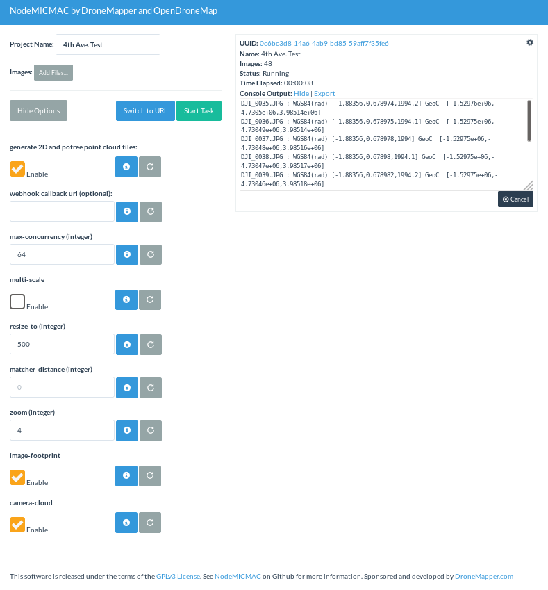

# NodeMICMAC


NodeMICMAC is a Node.js App and REST API to access [MicMac](https://github.com/micmacIGN/micmac). It exposes an API which is used by [WebODM](https://github.com/OpenDroneMap/WebODM) or other projects.
This project is sponsored and developed by [DroneMapper](https://dronemapper.com). This repository was originally forked from [NodeODM](https://github.com/OpenDroneMap/NodeODM), which is part of the [OpenDroneMap](https://www.opendronemap.org/) Project.



|  |  |   |   |
|---------------------------------------------------------------------------------------------------|--------------------------------------------------------------------|---|---|
## Project Status
This list is not by order of importance.

- [x] Forked NodeODM
- [x] Updated README
- [x] New Dockerfile
- [x] Add MicMac Source Build
- [x] Initial Docker & Native Testing
- [x] `run.sh` and `run.py` Image Processor
- [x] Digital Elevation Model Creation
- [x] Orthomosaic Creation
- [ ] External and Relative Camera Orientation Exports
- [ ] Interfaces w/ Other Software (PMVS/OpenSFM/Pix4D/DroneMapper)
- [x] Point Cloud
- [x] Post Processing
- [ ] GCP Processing
- [ ] Oblique Imagery and/or 3D Model
- [x] Conform / Rename Outputs to ODM Conventions
- [x] Wire Up 2D and Potree Tile Creation
- [ ] Export Undistorted Images
- [ ] Utilize RPY Omega Phi Kappa
- [ ] Update Tests

Note: This project currently creates a geo-referenced DEM and Ortho from our 4th Ave. test imagery (and most likely your imagery). The results are located in their respective directories in UTM projection.

## Test Data
[DroneMapper 4th Ave. Reservoir](https://dronemapper.com/software/4thAve.zip) - 48 Geo-tagged Images DJI Phantom 3 Advanced


## Results


* Results clipped to an AOI and displayed using Global Mapper [GlobalMapper](https://bluemarblegeo.com)

## Mission Planning / Execution

* We recommend using a mission planning application such as MapPilot, DJI GS Pro, or Pix4DMapper.

## Getting Started

We recommend that you setup NodeMICMAC using [Docker](https://www.docker.com/).

* Docker image build:
```
docker build -t dronemapper/node-micmac .
```

* From the Docker Quickstart Terminal (Windows / OSX) or from the command line (Linux) type:
```
docker run -p 3000:3000 dronemapper/node-micmac
```

* If you're on Windows/OSX, find the IP of your Docker machine by running this command from your Docker Quickstart Terminal:

```
docker-machine ip
```

Linux users can connect to 127.0.0.1.

* Open a Web Browser to `http://<yourDockerMachineIp>:3000`
* Load [some images with geo-tags](https://dronemapper.com/sample_data/)
* Press "Start Task"
* Go for a walk or enjoy a pastis! :)

If the computer running NodeMICMAC is using an old or 32bit CPU, you need to compile OpenDroneMap from sources and setup NodeMICMAC natively. You cannot use docker. Docker images work with CPUs with 64-bit extensions, MMX, SSE, SSE2, SSE3 and SSSE3 instruction set support or higher. Seeing a `Illegal instruction` error while processing images is an indication that your CPU is too old. 

## API Docs

See the DM [API Documentation Page](http://dronemapper.io/docs/) or ODM [API Documentation Page](https://github.com/OpenDroneMap/NodeODM/blob/master/docs/index.adoc).

## Run Tasks from the Command Line

You can use [CloudODM](https://github.com/OpenDroneMap/CloudODM) to run tasks with NodeMICMAC from the command line. _(Untested)_

## Using an External Hard Drive (Not Recommended/Performance IO Reasons)

If you want to store results on a separate drive, map the `/var/www/data` folder to the location of your drive:

```bash
docker run -p 3000:3000 -v /mnt/external_hd:/var/www/data dronemapper/node-micmac
```

This can be also used to access the computation results directly from the file system.

### Run it Natively

If you are already running [ODM](https://github.com/OpenDroneMap/ODM) on Ubuntu natively you can follow these steps:

* You may need to step through the Dockerfile and install missing dependencies listed there to install natively.

1] Install PotreeConverter and LASzip dependency
 
```bash
apt-get install -y libboost-dev libboost-program-options-dev exiftool

pip install Shapely
pip install utm

mkdir /staging
git clone https://github.com/pierotofy/LAStools /staging/LAStools
cd LAStools/LASzip
mkdir build
cd build
cmake -DCMAKE_BUILD_TYPE=Release ..
make

git clone https://github.com/pierotofy/PotreeConverter /staging/PotreeConverter
cd /staging/PotreeConverter
mkdir build
cd build
cmake -DCMAKE_BUILD_TYPE=Release -DLASZIP_INCLUDE_DIRS=/staging/LAStools/LASzip/dll -DLASZIP_LIBRARY=/staging/LAStools/LASzip/build/src/liblaszip.a ..
make && sudo make install
```
2] Install gdal2tiles.py script, node.js and npm dependencies

```bash
sudo curl --silent --location https://deb.nodesource.com/setup_6.x | sudo bash -
sudo apt-get install -y nodejs python-gdal
git clone hhttps://github.com/dronemapper-io/NodeMICMAC.git
cd NodeMICMAC
npm install
```

3] Start NodeMICMAC

```
nodejs index.js
```

Use odm_path

```
nodejs index.js --odm_path /home/projects/NodeMICMAC/dm/
```

For other command line options you can run:

```
nodejs index.js --help
```

You can also specify configuration values via a JSON file:

```
nodejs index.js --config config.default.json
```

Command line arguments always take precedence over the configuration file.

### Run it using PM2

The app can also be run as a background process using the [pm2 process manager](https://github.com/Unitech/pm2), which can also assist you with system startup scripts and process monitoring.

To install pm2, run (using `sudo` if required):
```shell
npm install pm2 -g
```
The app can then be started using
```shell
pm2 start processes.json
```
To have pm2 started on OS startup run
```shell
pm2 save
pm2 startup
```
and then run the command as per the instructions that prints out. If that command errors then you may have to specify the system (note that systemd should be used on CentOS 7). Note that if the process is not running as root (recommended) you will need to change `/etc/init.d/pm2-init.sh` to set `export PM2_HOME="/path/to/user/home/.pm2"`, as per [these instructions](
http://www.buildsucceeded.com/2015/solved-pm2-startup-at-boot-time-centos-7-red-hat-linux/)

You can monitor the process using `pm2 status`.

### Test Mode

If you want to make a contribution, but don't want to setup OpenDroneMap or MICMAC, or perhaps you are working on a Windows machine, or if you want to run automated tests, you can turn test mode on:

```
node index.js --test
```

While in test mode all calls to OpenDroneMap/MICMAC's code will be simulated (see the /tests directory for the mock data that is returned).

### Test Images

You can find some test drone images [here](https://dronemapper.com/sample_data/).

## What if I need more functionality?

NodeMICMAC is meant to be a lightweight API.

## Contributing

Make a pull request for small contributions. For big contributions, please open a discussion or issue first. Please use ES6 syntax while writing new Javascript code so that we can keep the code base uniform.

You can also contact us [here](https://dronemapper.com/contact)

## Roadmap

Stay current with upstream MicMac development providing an easy to use interface and API. Roll in upstream ODM API changes into this repo. Test, Process Images, Rinse, Repeat!

## MicMac Version

Cloned: 04-26-2019 Commit: [fec03b2](https://github.com/micmacIGN/micmac/commit/fec03b2b9596886f9b929f5b663bbded3ae591c0)